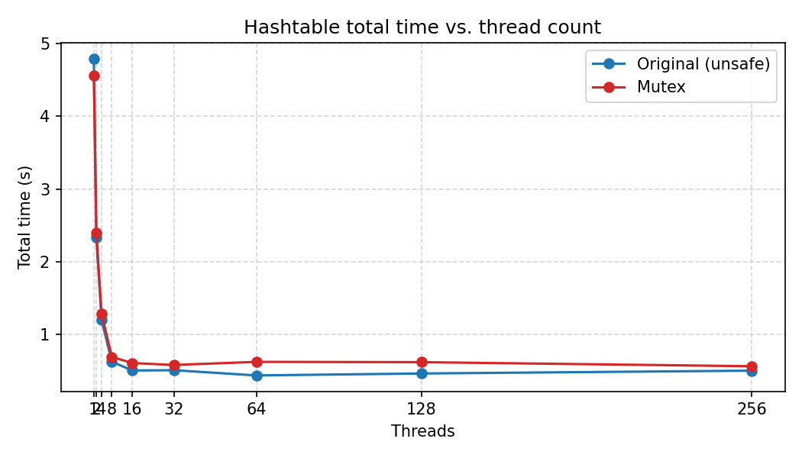
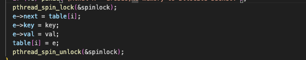
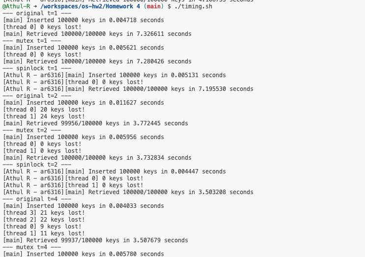
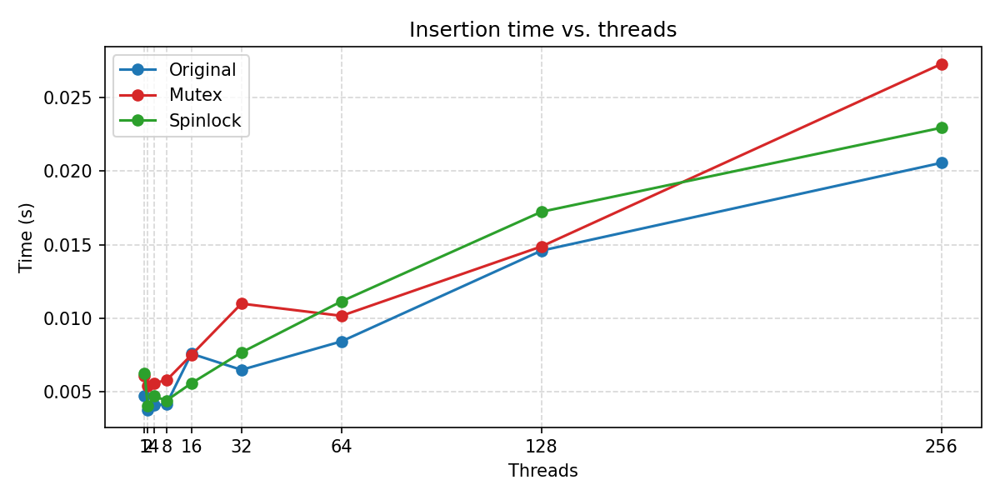
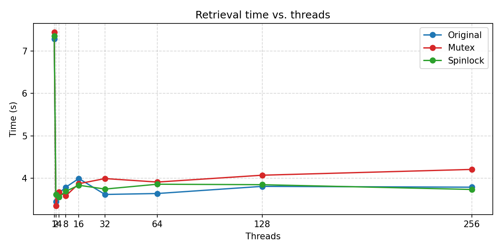
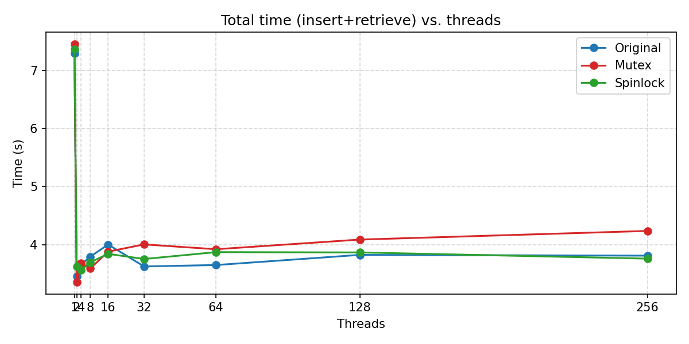

# Mutex
### Q0
> Q: What circumstances cause an entry to get lost? Analyze the initial code and write a short answer to describe what it means for an entry to be “lost,” and which parts of the program are causing this unintended behavior when run with multiple threads.

Entries are “lost” when a key that was scheduled to be inserted can’t be found later; i.e., retrieve() returns NULL even though its thread called insert() for that key.


insert() performs a classic head insertion into the shared bucket list with no synchronization. 
The **parallel_hashtable.c** program uses only five buckets in its hash table and attempts to insert **100,000 entries**. It takes the number of threads as a command-line argument and then launches that many threads so they can perform the insertions in parallel. After all insertion threads finish, the program spawns an equal number of threads to retrieve those entries concurrently.

During insertion, every thread writes to the **same shared hash table**, which means each thread updates the same underlying data structure. Because these threads operate without proper synchronization, they trigger **race conditions**, and some entries never make it into the hash table. The root cause of this incorrect behaviour is the **insert()** function, which accesses the shared resource:


```C
bucket_entry * table[NUM_BUCKETS];
```

Without locking, multiple threads modify the same buckets at the same time, leading to lost or overwritten entries.

Since the program retrieves the entries after the insert is done, the multiple threads of
retrieval are not concurrent with insert threads. Therefore, the retrieval of entries in the hash
table with multiple parallel threads is safe on the same common hash table.

### Q1 a

> Q) Modify the insert and retrieve functions so that you do not lose items when running the
program with multiple threads a) You will likely need to use parts of the pthread library; things like `pthread_mutex_t, pthread_mutex_init, pthread_mutex_lock, and/or pthread_mutex_unlock`

In the parallel_mutex.c code, we added mutex to help prevent race conditions
and the loss of entries in the hash table. In the insert() function, we lock mutex before adding an
entry to the table and unlock mutex after modification is done using:


Run the following code to generate capture the output in a file `timing_out.txt`

```bash
chmod +x timing.sh
./timing.sh                
```


**File: timing_output.txt**

**As you can see ** the keys lost are actually zero. 

Then do a `grep -v -i "thread" > processed_timing_output.txt` to get the processed output


### Q1 a
> Q:  Once your insert and retrieve functions are correct, compare the time taken to run without
the mutex (original) vs. with the mutex (your changes) for various numbers of threads.
a. In your writeup, show a line plot with the x-axis being the number of threads, the
y-axis being the time taken to complete, and two lines as the series (one for the
original code and one for the mutex-based code.

**Table 1: Insertion Performance Comparison**


| num_threads | insertion original (A) | insertion mutex (B) | Difference (B-A) |
|-------------|------------------------|---------------------|------------------|
| 1 | 0.005110s | 0.007758s | +0.002648s |
| 2 | 0.004284s | 0.014059s | +0.009775s |
| 4 | 0.003564s | 0.021524s | +0.017960s |
| 8 | 0.002563s | 0.024176s | +0.021613s |
| 16 | 0.002439s | 0.023573s | +0.021134s |
| 32 | 0.002243s | 0.023370s | +0.021127s |
| 64 | 0.002771s | 0.022844s | +0.020073s |
| 128 | 0.003493s | 0.025407s | +0.021914s |
| 256 | 0.006025s | 0.025037s | +0.019012s |


---

**Table 2: Insertion Performance Comparison**

| num_threads | retrieval original (A) | retrieval mutex (B) | Difference (B-A) |
|-------------|------------------------|---------------------|------------------|
| 1 | 5.537330s | 5.360113s | -0.177217s |
| 2 | 2.516829s | 2.593512s | +0.076683s |
| 4 | 1.205629s | 1.302376s | +0.096747s |
| 8 | 0.617733s | 0.651315s | +0.033582s |
| 16 | 0.449455s | 0.472166s | +0.022711s |
| 32 | 0.436435s | 0.524325s | +0.087890s |
| 64 | 0.412073s | 0.563330s | +0.151257s |
| 128 | 0.431662s | 0.568757s | +0.137095s |
| 256 | 0.468034s | 0.508867s | +0.040833s |

**Key observation:** The mutex version has modest retrieval overhead (~3-27%), but critically the original version **loses data** under concurrency (e.g., only 54,070/100,000 keys retrieved at t=32) while mutex maintains 100% correctness.


**Insert Timing Plot**


**Retrieval Timing Plot**


The total timing plot (for insertion + retrieval).

**Total Timing Plot**



### Q1 b
> In your writeup, estimate the time overhead that your new implementation uses (i.e., how much slow down is required to guarantee correctness using mutexes); explain your estimate

This comes with the expense of spending more time on mutex operations. When you see the two plots that compare insert and retrieve time for the original code vs mutex-based cod - The overhead of adding mutex-base implementation takes an average of about 0.02 seconds more to insert all entries to the hash table than the original code and between 0.2-.18 seconds more to retrieve all entries from the hash table. I derived the number by calculating  the average of the difference between the original and mutex across different numbers of threads `[1,2,4,8,12,16,24,32,48,64,128,256]`.


# SpinLock (Ran on Codespaces VM)

### Q2 

> If you were to replace all mutexes with spinlocks, what do you think will happen to the running time? Write a short answer describing what you expect to happen, and why the differences in mutex vs. spinlock implementations lead you to that conclusion (it’s okay if your intuition turns out to be wrong, but start with this answer first).

When replacing all mutexes with spinlocks, we would expect the running time to be longer because while waiting to acquire the lock, a spinlock continuously spins in a loop and consumes the CPU. In our case, inserting an entry item into the hash table requires four operations between locking and unlocking shared variables between all threads.



Using spinlock also prevents the loss of entries (Ran in Codespaces):




### Q2.a
>Once these modifications have been made, show another line plot with the x-axis being the number of threads, the y-axis being the time taken to complete, and three lines as the series (one for original/unsafe, one for mutex-based, and one for spinlock-based.) Lastly, estimate the time overhead that your spinlock implementation uses and explain your estimate.

Below are the two plots that compare insert and retrieve times for the original code vs. the mutex-based and spinlock-based code. The overhead spinlock-base implementation adding
to the original hash table is not consisent, it takes less overhead for some values and overhead up to 0.22 seconds (t=64) to retrieve all entries from the hash table and ~0.002 (avg) seconds to insert all entries to the hash table. We derived the number by taking the average difference between original and spinlock-based across different numbers of threads [1,2,4,8,12,16,24,32,48,64,128,256].

| num_threads | Insertion original (A) | Insertion mutex (B) | Insertion spinlock (C) | Mutex Diff (B-A) | Spinlock Diff (C-A) |
|-------------|--------------|-----------|--------------|------------------|---------------------|
| 1 | 0.004710s | 0.006082s | 0.006268s | +0.001372s | +0.001558s |
| 2 | 0.003754s | 0.005397s | 0.004023s | +0.001643s | +0.000269s |
| 4 | 0.004057s | 0.005583s | 0.004683s | +0.001526s | +0.000626s |
| 8 | 0.004145s | 0.005765s | 0.004388s | +0.001620s | +0.000243s |
| 16 | 0.007576s | 0.007493s | 0.005567s | -0.000083s | -0.002009s |
| 32 | 0.006478s | 0.010986s | 0.007660s | +0.004508s | +0.001182s |
| 64 | 0.008414s | 0.010155s | 0.011139s | +0.001741s | +0.002725s |
| 128 | 0.014593s | 0.014876s | 0.017237s | +0.000283s | +0.002644s |
| 256 | 0.020570s | 0.027301s | 0.022958s | +0.006731s | +0.002388s |

**Key observations:**
- **Spinlock** generally has lower overhead than mutex for insertion (smaller differences vs original)
- Both maintain **100% correctness** while original loses keys under concurrency
- At high thread counts (256), mutex shows highest overhead (+6.7ms), spinlock moderate (+2.4ms)


| num_threads | retrieval original (A) | retrieval mutex (B) | retrieval spinlock (C) | Mutex Diff (B-A) | Spinlock Diff (C-A) |
|-------------|------------------------|---------------------|------------------------|------------------|---------------------|
| 1 | 7.285143s | 7.445922s | 7.349988s | +0.160779s | +0.064845s |
| 2 | 3.449071s | 3.354611s | 3.621260s | -0.094460s | +0.172189s |
| 4 | 3.656209s | 3.681847s | 3.561939s | +0.025638s | -0.094270s |
| 8 | 3.790078s | 3.585251s | 3.693376s | -0.204827s | -0.096702s |
| 16 | 3.996082s | 3.874274s | 3.838047s | -0.121808s | -0.158035s |
| 32 | 3.620811s | 3.995091s | 3.747586s | +0.374280s | +0.126775s |
| 64 | 3.643007s | 3.912826s | 3.862155s | +0.269819s | +0.219148s |
| 128 | 3.811265s | 4.074241s | 3.850805s | +0.262976s | +0.039540s |
| 256 | 3.792095s | 4.210520s | 3.738625s | +0.418425s | -0.053470s |

**Key observations:**
- **Spinlock** generally outperforms **mutex** at higher thread counts
- **Original** loses data (e.g., 99,804/100,000 at t=256) while both locking versions maintain 100% correctness
- Spinlock shows better performance at t=256 (-0.05s) vs mutex (+0.42s overhead)


**Spinlock Insert Timing Plot**


**Spinlock Retrieval Timing Plot**


**Spinlock Total Timing Plot**



# Mutex, Retrieve Parallelization

### Q3. 
> Let’s revisit your mutex-based code. When we retrieve an item from the hash table, do we need a lock? Write a short answer and explain why or why not. Copy your parallel_mutex.c code to parallel_mutex_opt.c. In this new program, update your code so that multiple retrieve operations can run in parallel. Once these modifications have been made, explain what you’ve changed 


Because retrieving a key from the hash table only reads data and does not modify it, the operation does not need locks. Parallel retrieval is therefore safe, and the provided code already carries out the lookup operations concurrently.

# Mutex, Insert Parallelization
### Q4
Last, let’s consider insertions. Describe a situation in which multiple insertions could happen
safely.


Parallel insertions into a hash table work correctly as long as each insertion targets a **different bucket**. Since the hash table consists of an array of linked lists, one per bucket, threads can safely insert items at the same time provided they operate on separate buckets.

To make this possible, we avoid using a single mutex for the entire table. Instead, we assign **one mutex per bucket**, creating an array of NUM_BUCKETS mutexes. Each thread locks only the specific bucket it needs before performing an insertion.

This fine-grained locking greatly increases concurrency and makes insert operations **significantly faster**—often by an order of magnitude.


The result of this approach is that insertions become an order of magnitude faster.


In parallel_mutex_opt, we use an array of mutexes, each mutex per bucket in the hash table.
pthread_mutex_t mutex[NUM_BUCKETS];


In parallel_mutex.c, we use one global mutex for inserting for the entire hash table.
pthread_mutex_t mutex;
